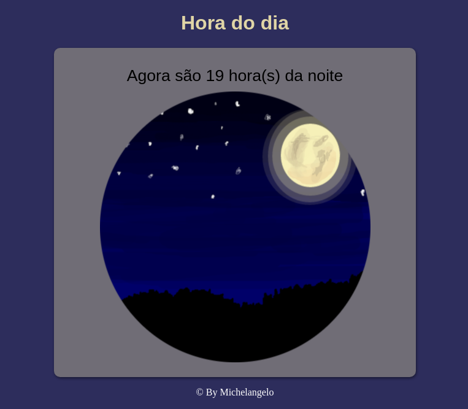

 
                 
  ## CORES DO DIA COM JAVASCRIPT, CSS & HTML
### https://cores-do-dia.netlify.app/
### O projeto baseia-se no propósito de mostrar a hora real e alterar cores de acordo com as condições a seguir:

#### hora < 12 : Manhã

  
  

#### hora >= 12hr e hora < 18hr : Tarde

  
  

#### hora >= 18 : Noite

  
  

